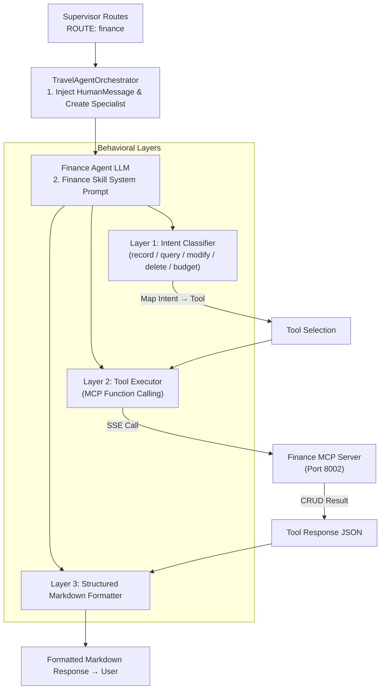

# Travel Assistant - Travel Finance & Expense Management Skill (Finance Agent)

This document defines the formal specification, architecture, and behavioral guidelines for the **Travel Finance & Expense Management** capability (the **Finance Skill**) within the Travel Assistant multi-agent infrastructure.

---

## 1. Architectural Overview

The Finance Agent is a specialist sub-agent instantiated exclusively when the Supervisor routes a query with `[ROUTE: finance]` (or multiple routes containing `finance`). It operates in full isolation, receiving only the 5 finance tools from the unified tool catalog, preventing cross-domain function calling and guaranteeing maximum precision. All persistent data flows through the **Finance MCP Server** over SSE on port `8002`:

*   **Layer 1: Intent Classifier**: Maps the user's natural language request (bilingual, Spanish/English) to one of the five finance tools (`record_expense`, `query_expenses`, `modify_expense`, `delete_expense`, `budget`) without ambiguity.
*   **Layer 2: Tool Executor**: Issues the MCP function call after validation (including double confirmation for destructive actions), forwarding all relevant parameters to the Finance MCP Server via SSE.
*   **Layer 3: Structured Markdown Formatter**: Once the tool response arrives, presents all retrieved data to the user in a rich, numbered Markdown layout including ID, category, description, amount, and date.

---

## 2. Tool Isolation & Agent Factory

The Finance Agent is instantiated by the `create_finance_agent` factory (`app/agents/finance/agent.py`). It applies a strict tool filter from the unified catalog:

| Filter Rule | Matched Tools |
| :--- | :--- |
| `"expense" in tool.name` or `"budget" in tool.name` | `record_expense`, `query_expenses`, `modify_expense`, `delete_expense`, `budget` |

This isolation guarantees that the Finance Agent **never sees reminder tools** (`record_reminder`, `query_reminders`, etc.), eliminating cross-domain function calling noise entirely.

---

## 3. MCP Tool Catalog (Finance Server — Port `8002`)

All finance data is managed exclusively through the **Finance MCP Server** (`app/mcp/finance/server.py`). The server exposes 5 structured CRUD tools defined in `app/mcp/finance/tools.py`:

| Tool | Required Parameters | Optional Parameters | Purpose |
| :--- | :--- | :--- | :--- |
| `budget` | *(none)* | — | Returns the budget status and expenses breakdown |
| `record_expense` | `amount` (float), `description` (str), `category` (str) | — | Creates a new expense entry |
| `query_expenses` | *(none)* | `category` (str) | Lists expenses; filters by category if provided |
| `modify_expense` | `id` (int) | `amount` (float), `description` (str), `category` (str) | Updates one or more fields of an existing expense |
| `delete_expense` | `id` (int) | — | Permanently removes an expense from the database |

---

## 4. Behavioral Rules (System Prompt Directives)

The Finance Agent's behavior is governed by `get_finance_system_prompt()` (`app/agents/finance/prompts.py`). The following rules are enforced at all times:

### 4.1 Double Confirmation for Destructive Actions
Before calling `modify_expense` or `delete_expense`, the agent **must check the recent conversation history**:
*   If the user has not confirmed it, the agent **must not call the tool** and must reply asking the user for confirmation (stating that the action cannot be undone and has no rollback).
*   If the immediately preceding user message is a positive confirmation (e.g., *"sí"*, *"yes"*), only then execute the tool.

### 4.2 Immediate Tool Dispatch for Safe Actions
For safe actions (`record_expense`, `query_expenses`, `budget`), the tool **must be called immediately** without redundant confirmations.

### 4.3 Structured Markdown Presentation
When displaying expenses, the agent must output a complete numbered list detailing `ID`, `category`, `description`, `amount` (in Euros), and `date`, along with a breakdown of expenses aggregated by category.

### 4.4 Standard Expense Categories
To guarantee clean database entries and consistent frontend dashboard analytics, the agent **must map and record expenses** into one of the following recommended categories:
*   **Comida / Food**: Meals, drinks, coffee, restaurants, supermarkets.
*   **Transporte / Transport**: Taxis, metro, buses, train tickets, car rental, fuel.
*   **Alojamiento / Accommodation**: Hotels, hostels, Airbnb, apartments.
*   **Entretenimiento / Entertainment**: Museum tickets, tours, concert tickets, events.
*   **Otros / Others**: Shopping, gifts, pharmacy, unclassified costs.

*Matching language*: Use Spanish category names if the user writes in Spanish, and English category names if the user writes in English.
