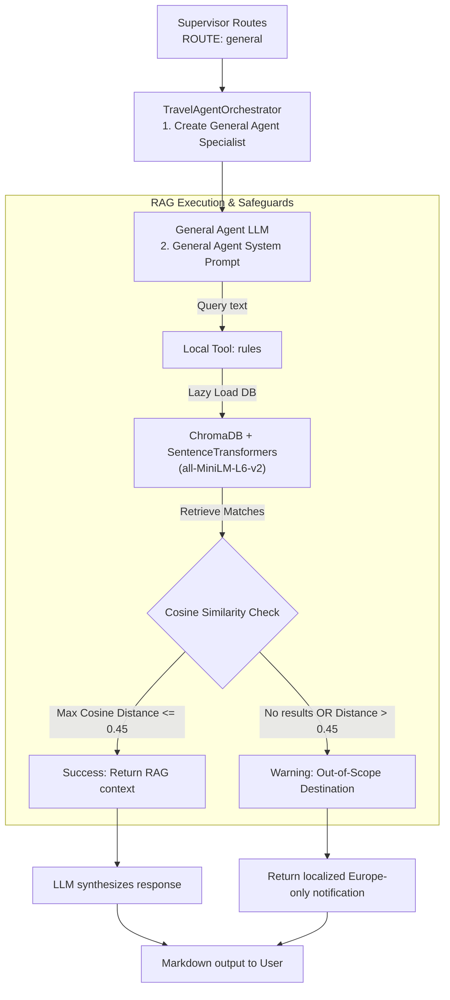

# Travel Assistant - General Support & Travel Regulations Skill (General Agent)

This document defines the formal specification, architecture, and behavioral guidelines for the **General Support & Travel Regulations** capability (the **General Skill**) within the Travel Assistant multi-agent infrastructure.

---

## 1. Architectural Overview

The General Agent is a specialist sub-agent instantiated when the Supervisor routes a query with `[ROUTE: general]`. It manages general support, travel documentation requirements, and real-time travel planning queries (flights, hotels, transport) via Brave Search. It utilizes a local vector database for Retrieval-Augmented Generation (RAG) and the Brave Search REST API:

*   **RAG Engine**: Sentence Transformers vector store utilizing a local ChromaDB instance to query files located in `rag_docs/`.
*   **European Limitation Safeguard**: If search queries do not return close semantic matches (distance > 0.45), the system intercepts the response to explain that the database is limited to European destinations.

---

## 2. Tool Catalogue (Local Tools)

The General Agent exposes two local tools defined in `app/agents/general/tools.py`:

| Tool | Required Parameters | Purpose |
| :--- | :--- | :--- |
| `rules` | `text` (str) | Queries RAG vector database for travel regulations (visas, passports, health alerts) |
| `travel_search` | `text` (str) | Real-time web search for flights, hotels, transport and travel planning via Brave Search |

---

## 3. Behavioral Guidelines & Scope Constraints

### 3.1 Strict Geographical Restraint (Europe Only)
*   The document database **only contains regulations and rules for European destinations**.
*   If a user asks about visa, vaccination, or passport requirements for a country outside Europe, the agent must decline the request politely using the localized warning response.

### 3.2 Bilingual Support
*   The agent detects the language of the incoming message (English or Spanish) and replies entirely in that language.
*   Formatting should use clean markdown, bullet points, and clear structural headers.

### 3.3 Relative Date Resolution
*   The General Agent prompt is generated dynamically using `get_general_system_prompt()`, anchoring the current date and time.
*   This context allows the agent to resolve expressions like *"tomorrow"*, *"next week"*, or *"this Friday"* in flight and logistics queries before passing them to tools.
