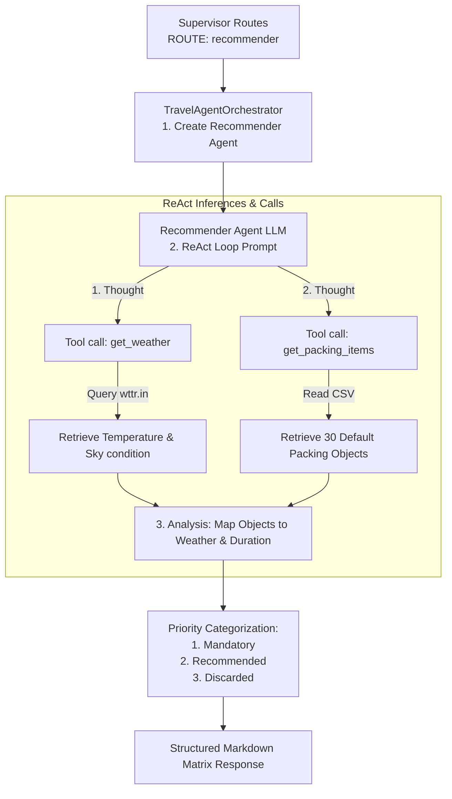

# Travel Assistant - Luggage & Packing Recommender Skill (Recommender Agent)

This document defines the formal specification, architecture, and behavioral guidelines for the **Luggage & Packing Recommender** capability (the **Recommender Skill**) within the Travel Assistant multi-agent infrastructure.

---

## 1. Architectural Overview

The Recommender Agent is a local-only specialist sub-agent (does not connect to remote MCP servers) instantiated when the Supervisor routes a query with `[ROUTE: recommender]`. It is designed using a **ReAct** (Reasoning + Acting) loop to dynamically retrieve current weather forecasts for the destination and classify travel essentials into three priority columns:

*   **ReAct Loop**: Sequentially calls weather forecasts and packing inventory datasets to make an informed classification.
*   **Default Objects Inventory**: Stored locally in a CSV file (`app/data/objetos.csv`) containing 30 standard travel items.

---

## 2. Tool Catalogue (Local Tools)

The Recommender Agent exposes two English-standardized local tools defined in `app/agents/recommender/tools.py`:

| Tool | Required Parameters | Purpose |
| :--- | :--- | :--- |
| `get_weather` | `city` (str) | Fetches current weather and temperature forecast from `wttr.in` |
| `get_packing_items` | *(none)* | Reads and returns the standard list of 30 items to be categorized |

---

## 3. Behavioral Guidelines

### 3.1 Trichotomic Classification Matrix
For every query, the agent must output a structured markdown table classifying the 30 default objects into:
1.  **Mandatory (Obligatorios)**: Absolute necessities based on the destination's current weather or duration (e.g., umbrella if raining, heavy coat if cold).
2.  **Recommended (Recomendados)**: Useful items to have (e.g., sunglasses if sunny, books/entertainment for long trips).
3.  **Discarded (Descartados)**: Items that are redundant or inappropriate for the current weather (e.g., shorts/swimwear in sub-zero winter temperatures).

### 3.2 Error Tolerant Weather Fetching
If `get_weather` returns an HTTP error or does not recognize the city, the agent must handle it gracefully by falling back to standard climate averages for the destination, keeping the application crash-free.

### 3.3 Relative Date Resolution
*   The Recommender Agent prompt is generated dynamically using `get_recommender_system_prompt()`, anchoring the current date and time.
*   This context allows the agent to parse relative trip dates (e.g., *"for next Monday"*, *"5 days starting tomorrow"*) to correctly determine trip duration and align it with packing logic.
