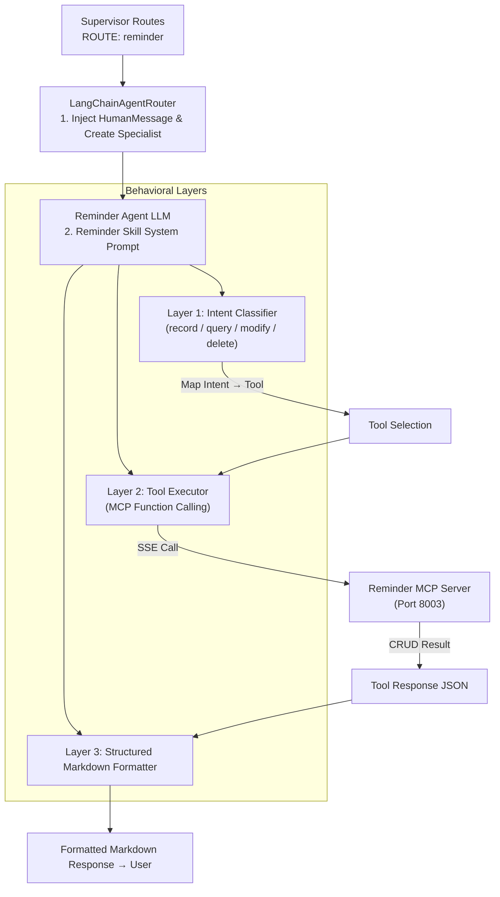
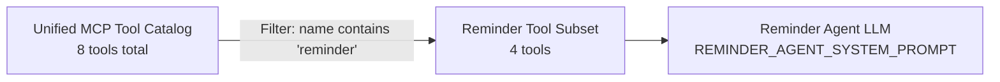
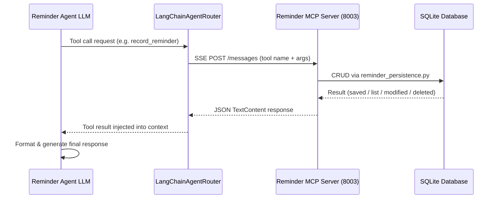

# Travel Assistant - Reminder & Itinerary Management Skill (Reminder Agent)

This document defines the formal specification, architecture, and behavioral guidelines for the **Reminder & Itinerary Management** capability (the **Reminder Skill**) within the Travel Assistant multi-agent infrastructure.

---

## 1. Architectural Overview

The Reminder Agent is a specialist sub-agent instantiated exclusively when the Supervisor routes a query with `[ROUTE: reminder]`. It operates in full isolation, receiving only the 4 CRUD reminder tools from the unified tool catalog, preventing cross-domain function calling and guaranteeing maximum precision. All persistent data flows through the **Reminder MCP Server** over SSE on port `8003`:



*   **Layer 1: Intent Classifier**: Maps the user's natural language request (bilingual, Spanish/English) to one of the four CRUD tools (`record_reminder`, `query_reminders`, `modify_reminder`, `delete_reminder`) without ambiguity.
*   **Layer 2: Tool Executor**: Issues the MCP function call immediately and without unnecessary confirmations, forwarding all relevant parameters to the Reminder MCP Server via SSE.
*   **Layer 3: Structured Markdown Formatter**: Once the tool response arrives, presents all retrieved data to the user in a rich, numbered Markdown layout including ID, title, due date/time, and optional note for every entry.

---

## 2. Tool Isolation & Agent Factory

The Reminder Agent is instantiated by the `create_reminder_agent` factory (`app/agents/reminder/agent.py`). It applies a strict tool filter from the unified catalog:



| Filter Rule | Matched Tools |
| :--- | :--- |
| `"reminder" in tool.name` | `record_reminder`, `query_reminders`, `modify_reminder`, `delete_reminder` |

This isolation guarantees that the Reminder Agent **never sees finance tools** (`record_expense`, `query_expenses`, `modify_expense`, `delete_expense`, `budget`), eliminating cross-domain function calling noise entirely.

---

## 3. MCP Tool Catalog (Reminder Server — Port `8003`)

All reminder data is managed exclusively through the **Reminder MCP Server** (`app/mcp/reminder/server.py`). The server exposes 4 structured CRUD tools defined in `app/mcp/reminder/tools.py`:

| Tool | Required Parameters | Optional Parameters | Purpose |
| :--- | :--- | :--- | :--- |
| `record_reminder` | `title` (str), `due_time` (str) | `note` (str) | Creates a new reminder or itinerary task |
| `query_reminders` | *(none)* | `date_filter` (str, `YYYY-MM-DD`) | Lists reminders; if `date_filter` supplied, returns only reminders for that day |
| `modify_reminder` | `id` (int) | `title` (str), `due_time` (str), `note` (str) | Updates one or more fields of an existing reminder by ID |
| `delete_reminder` | `id` (int) | — | Permanently removes a reminder from the database |

### 3.1 Tool Parameter Details

**`record_reminder`**
*   `title`: Title or name of the reminder. Example: `"Flight check-in"`, `"Recoger maleta"`.
*   `due_time`: Absolute datetime in `YYYY-MM-DD HH:MM` format — **always resolved by the agent before calling the tool**. The user may say `"mañana a las 9h"` or `"in 3 days"` and the agent converts it. Example resolved value: `"2026-06-01 09:00"`.
*   `note` *(optional)*: Additional details or annotations. Example: `"Do not forget the passport"`.

**`modify_reminder`**
*   `id`: Unique integer ID of the reminder to update (obtained from a prior `query_reminders` call).
*   At least one of `title`, `due_time`, or `note` must be provided; unspecified fields are left unchanged.

**`delete_reminder`**
*   `id`: Unique integer ID of the reminder to permanently erase.

---

## 4. Behavioral Rules (System Prompt Directives)

The Reminder Agent's behavior is governed by `get_reminder_system_prompt()` (`app/agents/reminder/prompts.py`), a function called at agent instantiation time that injects the current date and time as a context anchor. The following rules are enforced at all times:

### 4.1 Immediate Tool Dispatch (No Redundant Confirmations)

The agent **must call the appropriate tool immediately** as soon as the user's intent is recognized. There is no intermediate confirmation step:

| User Intent | Tool Called |
| :--- | :--- |
| View, list, show, check reminders / *"ver recordatorios"*, *"agenda"* | `query_reminders` |
| Add, create, record, schedule a reminder / *"añadir recordatorio"*, *"crear aviso"* | `record_reminder` |
| Edit, modify, update a reminder / *"modificar recordatorio"*, *"cambiar alarma"* | `modify_reminder` |
| Remove, delete, cancel a reminder / *"eliminar"*, *"borrar recordatorio"* | `delete_reminder` |

### 4.2 Structured Markdown Presentation

When `query_reminders` (or any tool returning reminder data) responds with stored records, the agent **must present the full dataset** in a rich, structured Markdown format. Partial or summary-only replies are forbidden:

*   Numbered list of all reminders.
*   Each entry displays: **ID**, **Title/Description**, **Due Date & Time**, **Note** (if present).
*   Example output structure:

```
### 🗓️ Your Reminders

1. **ID 1** — Flight check-in
   - 📅 Due: 2026-06-01 at 10:00
   - 📝 Note: Do not forget the passport

2. **ID 2** — Recoger maleta en consigna
   - 📅 Due: mañana a las 14:00
```

### 4.3 Multilingual Directive

The agent **always replies in the same language the user wrote in**. If the user writes in Spanish, the entire response is in Spanish. If in English, the response is in English. This rule is strict and takes precedence over the language of tool schemas or internal identifiers.

**Title & note preservation:** The `title` and `note` fields passed to `record_reminder` or `modify_reminder` are **always stored exactly as the user wrote them** — never translated. If the user says *"recuérdame comprar el pan"*, the stored title is `"comprar el pan"`, not `"buy bread"`.

### 4.4 Date Resolution Directive

Before calling `record_reminder` or `modify_reminder`, the agent **must resolve any relative or natural language date/time expression into an absolute `YYYY-MM-DD HH:MM` string**. The current datetime is injected into the system prompt at instantiation time (`get_reminder_system_prompt()`) and serves as the reference anchor. Raw relative strings are never passed directly to the tool.

#### 4.4.1 Bilingual Resolution Table

| Spanish Expression | English Expression | Resolves to |
| :--- | :--- | :--- |
| `hoy` | `today` | current ISO date |
| `mañana` | `tomorrow` | current date + 1 day |
| `pasado mañana` | `day after tomorrow` | current date + 2 days |
| `ayer` | `yesterday` | current date − 1 day |
| `antes de ayer`, `anteayer` | `day before yesterday` | current date − 2 days |
| `dentro de X días` | `in X days` | current date + X days |
| `en X horas` | `in X hours` | current datetime + X hours |
| `la próxima semana` | `next week` | current date + 7 days |
| `el lunes / martes / ...` | `next Monday / Tuesday / ...` | nearest future occurrence of that weekday — **if tomorrow is that weekday, use tomorrow, do NOT skip to the following week** |
| `el DD/MM` / `el DD de mes` | `on MM/DD` / `on the Nth` | that calendar date |

*   If no time of day is specified for a `due_time`, the agent defaults to `09:00`.

#### 4.4.2 Resolution Examples — Write Operations

| User Input | Resolved `due_time` passed to tool |
| :--- | :--- |
| `"mañana a las 9h"` | `"2026-06-01 09:00"` |
| `"pasado mañana 18:30"` | `"2026-06-02 18:30"` |
| `"dentro de 3 días"` | `"2026-06-03 09:00"` |
| `"in 2 hours"` | current datetime + 2 h (e.g. `"2026-05-31 22:50"`) |
| `"next Monday at noon"` | `"2026-06-08 12:00"` |
| `"anteayer a las 20:00"` | `"2026-05-29 20:00"` |

#### 4.4.3 Resolution Examples — Query Filtering

When the user asks what they have scheduled for a given day, the agent resolves the expression to `YYYY-MM-DD` and passes it as `date_filter` to `query_reminders`:

| User Input | Tool Call |
| :--- | :--- |
| `"dime qué tengo para mañana"` | `query_reminders(date_filter="2026-06-01")` |
| `"dime qué tengo para el lunes"` | `query_reminders(date_filter="2026-06-08")` |
| `"dime qué tengo para el 1/6"` | `query_reminders(date_filter="2026-06-01")` |
| `"what do I have for next Monday"` | `query_reminders(date_filter="2026-06-08")` |
| `"muéstrame todo"` / `"show all"` | `query_reminders()` (no filter) |

---

## 5. MCP Server Transport & SSE Pipeline

The Reminder MCP Server (`app/mcp/reminder/server.py`) runs as an independent process on port `8003` and communicates with the agent via **Server-Sent Events (SSE)**:



*   The SSE endpoint is registered at `/sse` and `/sse/` (both forms to prevent HTTP 307 redirects).
*   The server exposes a `/status` health endpoint returning `online`, tool count, and full tool metadata.
*   Tool errors are caught at server level and returned as structured `TextContent` error messages, never crashing the SSE stream.

---

## 6. Persistence Layer

Reminder data is stored in **SQLite** (`travel_assistant.db`) via the domain persistence facade `app/services/persistence/reminder_persistence.py`. The MCP server acts as the sole write path; the agent never accesses the database directly.

| Operation | Persistence Function | Behavior |
| :--- | :--- | :--- |
| `record_reminder` → `save_reminder` | Creates a new row; returns the saved reminder object with auto-assigned `id` |
| `query_reminders` → `db_list_reminders(date_filter)` | Without filter: returns all rows ordered by `due_time` ascending. With `date_filter` (`YYYY-MM-DD`): returns only rows whose `due_time` starts with that date prefix |
| `modify_reminder` → `db_modify_reminder` | Patches only supplied fields; leaves unset fields unchanged |
| `delete_reminder` → `db_delete_reminder` | Hard-deletes the row by `id`; returns confirmation |

---

## 7. Persistent State & Checkpointer Integration

The Reminder Agent participates in the shared `MemorySaver` checkpointer pipeline managed by `LangChainAgentRouter`:

1.  **HumanMessage Injection**: Before the Reminder Agent is invoked, the Router explicitly writes the current `HumanMessage` to the LangGraph checkpointer via `aupdate_state(as_node="model")`. This ensures the specialist's timeline is correctly anchored and that future Sticky Routing inspections by the Supervisor can identify `reminder` as the last active domain.
2.  **Sub-Agent Isolation**: The Reminder Agent runs on its own compiled LangGraph instance. It reads the shared thread state but writes its responses under the same `thread_id`, maintaining a consistent and collision-free conversational timeline.
3.  **Transaction Safety**: All `aupdate_state` calls use `as_node="model"` to prevent `InvalidUpdateError` collisions in parallel thread scenarios.
