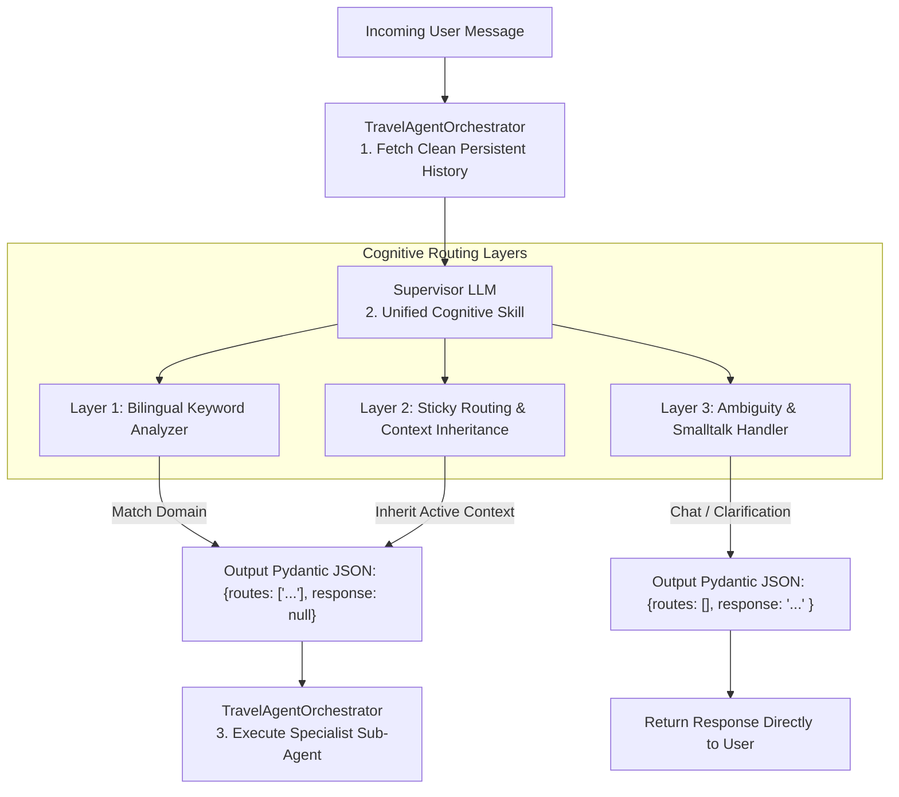

# Travel Assistant - Intelligent Routing & Structured Output Skill (Supervisor)

This document defines the formal specification, architecture, and behavioral guidelines for the **Intelligent Routing and Structured Output** capability (the **Supervisor Skill**) within the Travel Assistant multi-agent infrastructure.

---

## 1. Architectural Overview

The Supervisor acts as the cognitive gateway of the Travel Assistant, processing all incoming user messages. To achieve bulletproof accuracy, bilingual flexibility, and robust state inheritance, it employs a **Unified Cognitive Routing Architecture** managed by the **Supervisor Routing Skill (System Prompt)** utilizing OpenAI's **Structured Outputs**:

*   **Layer 1: Bilingual Keyword Analyzer**: Matches intent using a bilingual keywords list. Resolves direct commands (e.g. *"gasto"*, *"recordatorios"*, *"visa"*) seamlessly.
*   **Layer 2: Sticky Routing & Context Inheritance**: Evaluates conversational follow-ups, continuations, or vague requests lacking explicit domain words (e.g. *"delete"*, *"show"*). Inspects the clean SQL history provided by the Router to inherit the last active domain.
*   **Layer 3: Ambiguity & Smalltalk Handler**: Addresses greetings, Smalltalk, out-of-scope requests, or completely ambiguous queries directly.

This structured JSON model guarantees routing schema compliance, eliminating edge-case bugs, and allows the LLM to dynamically adapt to bilingual context changes.

---

## 2. Layer 1: Bilingual Keyword Matrices

Keywords are evaluated using regex boundaries to prevent substrings from causing false-positives.

| Domain | Spanish Keywords | English Keywords | Target Schema |
| :--- | :--- | :--- | :--- |
| **`finance`** | `gasto`, `gastos`, `presupuesto`, `presupuestos`, `dinero`, `finanzas`, `costo`, `costos`, `pagar`, `pagué` | `expense`, `expenses`, `budget`, `budgets`, `money`, `finance`, `finances`, `cost`, `costs`, `pay`, `paid` | `{ "routes": ["finance"], "response": null }` |
| **`reminder`** | `recordatorio`, `recordatorios`, `alarma`, `alarmas`, `agenda`, `recordar`, `recuerda`, `aviso`, `avisos` | `reminder`, `reminders`, `alarm`, `alarms`, `schedule`, `remember`, `alert`, `alerts`, `warn`, `warning` | `{ "routes": ["reminder"], "response": null }` |
| **`general`** | `visa`, `visas`, `vacuna`, `vacunas`, `normativa`, `normativas`, `requisito`, `requisitos`, `documentacion`, `documentación`, `itinerario`, `transporte`, `vuelo`, `vuelos`, `hotel`, `hoteles` | `vaccine`, `vaccines`, `regulation`, `regulations`, `requirement`, `requirements`, `documentation`, `itinerary`, `transport`, `flight`, `flights`, `hotels` | `{ "routes": ["general"], "response": null }` |

---

## 3. Layer 2: Sticky Routing & Context Inheritance Cognitive Algorithm

When the incoming query is concise, represents a continuation, or lacks direct bilingual domain keywords, the Supervisor LLM applies **Layer 2: Sticky Routing & Context Inheritance** semantically.

### 3.1 History Pre-Filtering (`_get_persistent_history`)
To avoid cognitive fatigue and guide the LLM accurately, the `TravelAgentOrchestrator` queries the persistent SQLite database for the conversation history:
*   Only high-level chat messages (`HumanMessage` and final `AIMessage` responses) are stored.
*   The timeline is completely clean of intermediate tool execution logs, routes, or internal tag logs.
*   This clean, high-level timeline allows the Supervisor to evaluate turns without parsing noisy details.

### 3.2 LLM Reasoning Rules for Context Inheritance
Using this filtered timeline, the Supervisor LLM determines context inheritance:
1.  **Identify the Last Active Domain**: Scans the most recent conversation turns. If the last assistant reply discussed expenses/budgets or was generated by the finance specialist, the active domain is declared `finance`. If it discussed itinerary/calendar/reminders, the active domain is `reminder`. If it discussed visas/vaccines/rules, the active domain is `general`.
2.  **Inherit Route Immediately**: If an active domain is found, the LLM inherits the route immediately by setting the `routes` field (e.g., `["finance"]`) without prompting the user for redundant confirmations (e.g. if the user says *"show"* or *"¿cuánto fue?"*).
3.  **Detect Subject Transitions**: If the user explicitly changes the topic (e.g. *"Now show me visas"* after a finance thread), the LLM detects the transition, overrides the sticky context, and outputs the new route (e.g., `["general"]`).

---

## 4. Layer 3: Ambiguity & Smalltalk Handler

When the fast-path matches and context inheritance do not apply, the Supervisor resolves the request:
1.  **No Redundant Clarifications**: If a domain is clear, route immediately. Do not ask *"would you like to list or add?"*.
2.  **Friendly Smalltalk**: Reply directly in the `response` field in a friendly, professional tone to greetings and small talk (e.g. *"hello"*, *"gracias"*), keeping `routes` as empty `[]`.
3.  **Ambiguous Requests**: If a query is completely ambiguous and there is no previous history to inherit from, reply directly in the `response` field asking the user to clarify their intent (e.g., *"¿Deseas gestionar gastos o crear recordatorios?"*).
4.  **Permitted Scope Exceptions**: Daily personal productivity reminders (e.g., *"comprar leche"*, *"ir al gym"*) and personal daily expenses (e.g., *"café"*, *"comida"*) are permitted exceptions. These must be enrouted to `reminder` or `finance` respectively, overriding the general travel-only scope filter.

---

## 5. Persistent State & Checkpointer Pipeline

To ensure that the conversation history is correctly persisted across turns and routing steps:
1.  **SQLite Persistent Log**: All conversation turns (user input and final response) are committed to `travel_assistant.db` to serve as the source of truth for conversational history.
2.  **HumanMessage Injection**: Prior to delegating execution to a specialist sub-agent, the Router writes the current `HumanMessage` to the LangGraph checkpointer `MemorySaver` using `aupdate_state`. This ensures that the specialist agent's timeline has a starting point.
3.  **Transaction Safety**: All `aupdate_state` calls are made with `as_node="model"` to prevent LangGraph state collisions (`InvalidUpdateError`).
