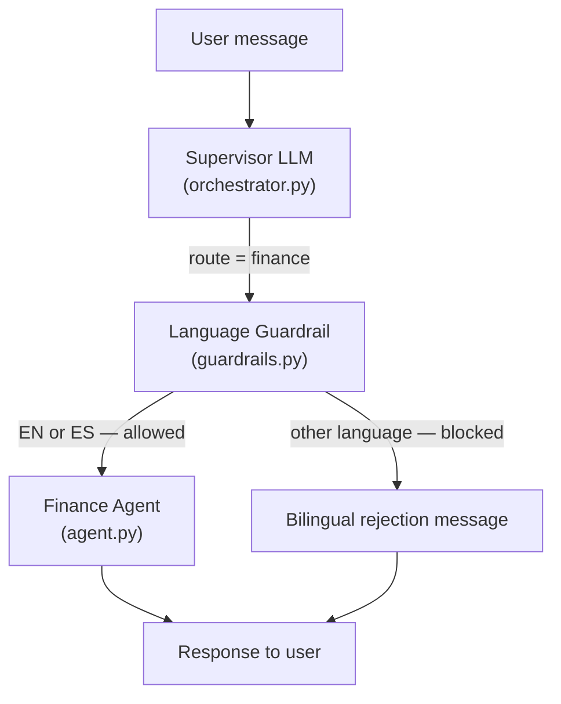

# Finance Language Guardrail

## Overview

The Finance Language Guardrail is a pre-invocation safety layer applied exclusively to the Finance Agent. It intercepts any message routed to the finance domain and blocks execution if the user's input is not written in English (`en`) or Spanish (`es`). Blocked requests receive an immediate bilingual rejection message without consuming any LLM tokens or MCP tool calls.

---

## Architecture

The guardrail sits between the Supervisor routing decision and the Finance Agent invocation inside `TravelAgentOrchestrator`:



---

## Implementation

### Files involved

| File | Role |
|------|------|
| `app/agents/finance/guardrails.py` | Guardrail module: language detection logic and rejection constant |
| `app/agents/orchestrator.py` | Wires the guardrail check before invoking `_run_specialized_agent` |
| `requirements.txt` | Declares the `langdetect` dependency |

---

### 1. Guardrail module (`app/agents/finance/guardrails.py`)

Uses the `langdetect` library to detect the ISO 639-1 language code of the incoming text. Only `en` and `es` are in the allow-list. Any other code — including `unknown` (returned when detection fails) — is rejected.

```python
from langdetect import detect, LangDetectException

ALLOWED_LANGUAGES = {"en", "es"}

REJECTION_MESSAGE = (
    "Sorry, the finance assistant only supports English and Spanish.\n"
    "Lo siento, el asistente de finanzas solo admite inglés y español."
)

def check_finance_language(text: str) -> tuple[bool, str]:
    """
    Returns (is_allowed, detected_lang).
    Allows English (en) and Spanish (es). Blocks everything else.
    """
    try:
        lang = detect(text)
    except LangDetectException:
        lang = "unknown"
    return lang in ALLOWED_LANGUAGES, lang
```

---

### 2. Orchestrator integration (`app/agents/orchestrator.py`)

The check is inserted in `handle_message`, after `run_supervisor` returns `route == "finance"` and before `_run_specialized_agent` is called:

```python
if route == "finance":
    allowed, detected_lang = check_finance_language(message)
    if not allowed:
        logger.info(
            "Finance guardrail blocked message (detected language: '%s')",
            detected_lang,
        )
        save_message(thread_id, "assistant", REJECTION_MESSAGE)
        return {
            "llm_used": False,
            "llm_tool": "finance_guardrail",
            "agent_used": "finance_guardrail",
            "tool_response": None,
            "message": REJECTION_MESSAGE,
        }
```

The `message` variable used for detection is always the **raw user input** (before memory context is injected), ensuring the language check is clean and unaffected by system context text.

---

## Dependency

`langdetect` is a pure-Python port of Google's language detection library. It requires no external API calls and supports 55 languages.

```bash
pip install langdetect
```

It is declared in `requirements.txt` and will be installed automatically with `pip install -r requirements.txt`.

---

## Behavior

| Input language | Detected code | Action |
|----------------|---------------|--------|
| English | `en` | Allowed — Finance Agent is invoked |
| Spanish | `es` | Allowed — Finance Agent is invoked |
| French | `fr` | Blocked — bilingual rejection returned |
| German | `de` | Blocked — bilingual rejection returned |
| Chinese | `zh-cn` | Blocked — bilingual rejection returned |
| Undetectable text | `unknown` | Blocked — bilingual rejection returned |

---

## Rejection message

```
Sorry, the finance assistant only supports English and Spanish.
Lo siento, el asistente de finanzas solo admite inglés y español.
```

The rejection is persisted to the conversation history (same as any other assistant message) so it appears correctly in the chat thread.
