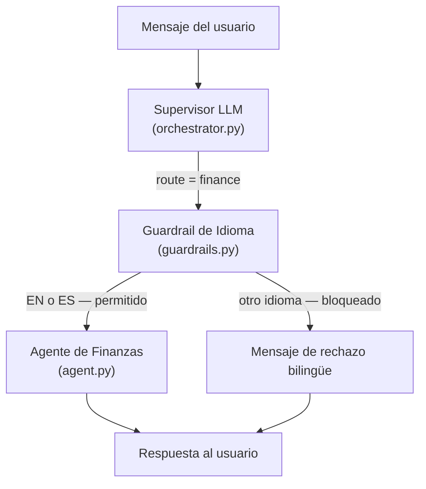

# Guardrail de Idioma para el Servicio de Finanzas

## Descripción general

El Guardrail de Idioma del Servicio de Finanzas es una capa de seguridad previa a la invocación, aplicada exclusivamente al Agente de Finanzas. Intercepta cualquier mensaje enrutado al dominio financiero y bloquea su ejecución si el texto del usuario no está escrito en inglés (`en`) o español (`es`). Las solicitudes bloqueadas reciben un mensaje de rechazo bilingüe de forma inmediata, sin consumir tokens de LLM ni llamadas a herramientas MCP.

---

## Arquitectura

El guardrail se sitúa entre la decisión de enrutamiento del Supervisor y la invocación del Agente de Finanzas, dentro de `TravelAgentOrchestrator`:



---

## Implementación

### Archivos implicados

| Archivo | Rol |
|---------|-----|
| `app/agents/finance/guardrails.py` | Módulo guardrail: lógica de detección de idioma y constante de rechazo |
| `app/agents/orchestrator.py` | Conecta la comprobación del guardrail antes de invocar `_run_specialized_agent` |
| `requirements.txt` | Declara la dependencia `langdetect` |

---

### 1. Módulo guardrail (`app/agents/finance/guardrails.py`)

Utiliza la librería `langdetect` para detectar el código de idioma ISO 639-1 del texto de entrada. Solo `en` y `es` están en la lista de idiomas permitidos. Cualquier otro código —incluyendo `unknown` (devuelto cuando la detección falla)— es rechazado.

```python
from langdetect import detect, LangDetectException

ALLOWED_LANGUAGES = {"en", "es"}

REJECTION_MESSAGE = (
    "Sorry, the finance assistant only supports English and Spanish.\n"
    "Lo siento, el asistente de finanzas solo admite inglés y español."
)

def check_finance_language(text: str) -> tuple[bool, str]:
    """
    Devuelve (is_allowed, detected_lang).
    Permite inglés (en) y español (es). Bloquea cualquier otro idioma.
    """
    try:
        lang = detect(text)
    except LangDetectException:
        lang = "unknown"
    return lang in ALLOWED_LANGUAGES, lang
```

---

### 2. Integración en el orquestador (`app/agents/orchestrator.py`)

La comprobación se inserta en `handle_message`, tras recibir `route == "finance"` del Supervisor y antes de llamar a `_run_specialized_agent`:

```python
if route == "finance":
    allowed, detected_lang = check_finance_language(message)
    if not allowed:
        logger.info(
            "Finance guardrail blocked message (detected language: '%s')",
            detected_lang,
        )
        save_message(thread_id, "assistant", REJECTION_MESSAGE)
        return {
            "llm_used": False,
            "llm_tool": "finance_guardrail",
            "agent_used": "finance_guardrail",
            "tool_response": None,
            "message": REJECTION_MESSAGE,
        }
```

La variable `message` utilizada para la detección es siempre el **texto crudo del usuario** (antes de que se inyecte el contexto de memoria), garantizando que la comprobación de idioma sea limpia y no se vea afectada por texto de contexto del sistema.

---

## Dependencia

`langdetect` es un port Python puro de la librería de detección de idioma de Google. No requiere llamadas a APIs externas y soporta 55 idiomas.

```bash
pip install langdetect
```

Se declara en `requirements.txt` y se instala automáticamente con `pip install -r requirements.txt`.

---

## Comportamiento

| Idioma de entrada | Código detectado | Acción |
|-------------------|------------------|--------|
| Inglés | `en` | Permitido — se invoca el Agente de Finanzas |
| Español | `es` | Permitido — se invoca el Agente de Finanzas |
| Francés | `fr` | Bloqueado — se devuelve el rechazo bilingüe |
| Alemán | `de` | Bloqueado — se devuelve el rechazo bilingüe |
| Chino | `zh-cn` | Bloqueado — se devuelve el rechazo bilingüe |
| Texto no detectable | `unknown` | Bloqueado — se devuelve el rechazo bilingüe |

---

## Mensaje de rechazo

```
Sorry, the finance assistant only supports English and Spanish.
Lo siento, el asistente de finanzas solo admite inglés y español.
```

El rechazo se persiste en el historial de conversación (igual que cualquier otro mensaje del asistente) para que aparezca correctamente en el hilo del chat.

---

## Pruebas

### Pruebas unitarias de detección de idioma (ejecutadas en CI)

Se verificó el módulo `guardrails.py` de forma aislada sobre 9 casos representativos. Resultado: **9/9 PASS**.

| # | Texto de entrada | Idioma detectado | Acción esperada | Resultado |
|---|-----------------|-----------------|-----------------|-----------|
| 1 | `Add an expense of 12 euros for lunch` | `en` | PERMITIDO | PASS |
| 2 | `Anota un gasto de 25 euros en taxi al aeropuerto` | `es` | PERMITIDO | PASS |
| 3 | `Muéstrame el resumen de mi presupuesto` | `es` | PERMITIDO | PASS |
| 4 | `Show me my budget summary` | `en` | PERMITIDO | PASS |
| 5 | `Ajoute une dépense de 30 euros pour le taxi` | `fr` | BLOQUEADO | PASS |
| 6 | `Füge eine Ausgabe von 20 Euro hinzu` | `de` | BLOQUEADO | PASS |
| 7 | `添加一笔50欧元的餐饮费用` | `zh-cn` | BLOQUEADO | PASS |
| 8 | `Adiciona uma despesa de 15 euros para o almoço` | `pt` | BLOQUEADO | PASS |
| 9 | `Aggiungi una spesa di 10 euro per pranzo` | `it` | BLOQUEADO | PASS |

---

### Pruebas E2E manuales (via API REST)

Con los tres servicios en marcha (`./start.sh`), ejecutar los siguientes `curl` desde una terminal:

#### Casos permitidos — deben llegar al Agente de Finanzas

```bash
# Español: registrar gasto
curl -s -X POST http://localhost:8000/message \
  -H "Content-Type: application/json" \
  -d '{"text": "Anota un gasto de 25 euros en taxi al aeropuerto", "session_id": "test_gr"}' | python3 -m json.tool

# Inglés: registrar gasto
curl -s -X POST http://localhost:8000/message \
  -H "Content-Type: application/json" \
  -d '{"text": "Add an expense of 12 euros for lunch", "session_id": "test_gr"}' | python3 -m json.tool

# Español: ver resumen
curl -s -X POST http://localhost:8000/message \
  -H "Content-Type: application/json" \
  -d '{"text": "Muéstrame el resumen de mis gastos", "session_id": "test_gr"}' | python3 -m json.tool
```

**Respuesta esperada:** `"agent_used": "finance"`, con el desglose de gastos en Markdown.

---

#### Casos bloqueados — deben ser rechazados por el guardrail

```bash
# Francés
curl -s -X POST http://localhost:8000/message \
  -H "Content-Type: application/json" \
  -d '{"text": "Ajoute une dépense de 30 euros pour le taxi", "session_id": "test_gr"}' | python3 -m json.tool

# Alemán
curl -s -X POST http://localhost:8000/message \
  -H "Content-Type: application/json" \
  -d '{"text": "Füge eine Ausgabe von 20 Euro für das Abendessen hinzu", "session_id": "test_gr"}' | python3 -m json.tool

# Portugués
curl -s -X POST http://localhost:8000/message \
  -H "Content-Type: application/json" \
  -d '{"text": "Adiciona uma despesa de 15 euros para o almoço", "session_id": "test_gr"}' | python3 -m json.tool

# Chino
curl -s -X POST http://localhost:8000/message \
  -H "Content-Type: application/json" \
  -d '{"text": "添加一笔50欧元的餐饮费用", "session_id": "test_gr"}' | python3 -m json.tool

# Italiano
curl -s -X POST http://localhost:8000/message \
  -H "Content-Type: application/json" \
  -d '{"text": "Aggiungi una spesa di 10 euro per pranzo", "session_id": "test_gr"}' | python3 -m json.tool
```

**Respuesta esperada:**
```json
{
  "llm_used": false,
  "agent_used": "finance_guardrail",
  "message": "Sorry, the finance assistant only supports English and Spanish.\nLo siento, el asistente de finanzas solo admite inglés y español."
}
```

**Log esperado en `logs/main.log`:**
```
INFO - Finance guardrail blocked message (detected language: 'fr')
```
