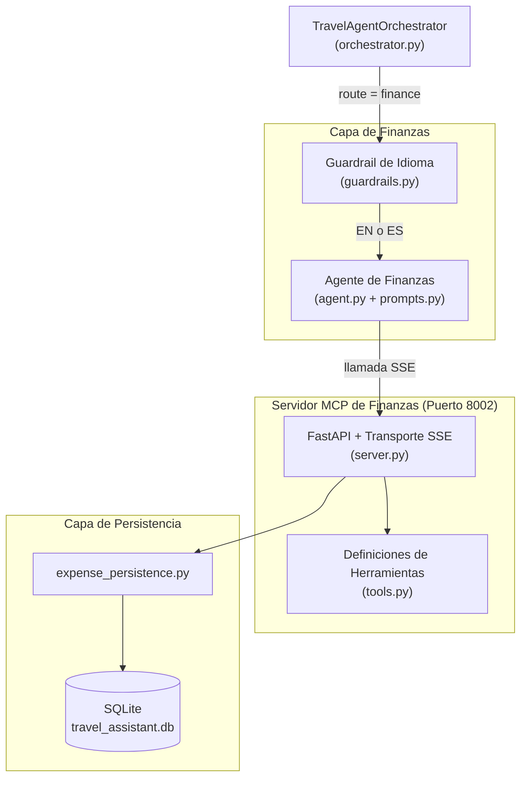

# Servicio de Finanzas

## Descripción general

El Servicio de Finanzas es el subsistema del Travel Assistant responsable de gestionar todas las transacciones económicas durante un viaje. Se implementa con una arquitectura desacoplada en dos capas:

1. **Agente de Finanzas** (`app/agents/finance/`) — sub-agente LangChain especializado exclusivamente en gestión de gastos, invocado por el orquestador cuando el Supervisor enruta un mensaje al dominio `finance`.
2. **Servidor MCP de Finanzas** (`app/mcp/finance/`) — proceso FastAPI independiente que corre en el puerto `8002` y expone herramientas CRUD de gastos a través del Model Context Protocol (MCP) mediante Server-Sent Events (SSE).

---

## Arquitectura



---

## Agente de Finanzas (`app/agents/finance/`)

### Archivos

| Archivo | Propósito |
|---------|-----------|
| `agent.py` | Función fábrica `create_finance_agent(llm, tools)` que compila el agente LangGraph |
| `prompts.py` | `get_finance_system_prompt()` — construye el prompt de sistema dinámico de finanzas con contexto de fechas relativas |
| `finance_skill.md` | Especificación técnica interna del skill del agente de finanzas |

### Comportamiento del agente

- Creado mediante `create_agent(llm, tools, system_prompt=...)` de LangChain.
- Recibe únicamente las herramientas de finanzas descubiertas desde el Servidor MCP de Finanzas (puerto `8002`), evitando cualquier contaminación cruzada de herramientas entre dominios.
- Sin estado (stateless): sin checkpointer interno. La memoria e historial de conversación son inyectados como contexto por el orquestador.

### Directrices del prompt de sistema (`prompts.py`)

El prompt se genera dinámicamente en cada llamada mediante `get_finance_system_prompt()`, que inyecta el contexto de fecha/hora actual desde `app/utils/date_resolution.py`.

1. **Selección de herramienta**: mapea directamente la intención del usuario a la herramienta MCP correcta (`budget`, `query_expenses`, `record_expense`, `modify_expense`, `delete_expense`).
2. **Salida contextual en Markdown**: el agente adapta su respuesta según la acción solicitada:
   - Si el usuario **pide ver, listar o revisar** gastos: muestra el desglose completo (total, recuento, resumen por categoría y lista con ID/descripción/cantidad/categoría/fecha).
   - Si el usuario **registra** un gasto: muestra **solo** la confirmación del gasto recién creado (ID, descripción, cantidad, categoría, fecha).
   - Si el usuario **modifica** un gasto: muestra solo los detalles del gasto actualizado.
   - Si el usuario **elimina** un gasto: muestra solo una confirmación con el ID eliminado.
   - **NUNCA** lista todos los gastos automáticamente tras una operación de creación/modificación/eliminación.
3. **Multilingüe**: responde siempre en el idioma en que el usuario escribe (inglés o español).
4. **Resolución de fechas relativas**: resuelve expresiones como "ayer", "la semana pasada", "last month" usando el contexto de fecha actual inyectado. Como `query_expenses` no acepta filtros de fecha, recupera todos los gastos y filtra por fecha en la respuesta.
5. **Double Confirmation para acciones destructivas**: antes de llamar a `modify_expense` o `delete_expense`, el agente verifica en el historial si el usuario ha confirmado explícitamente la acción. Si no hay confirmación previa, solicita confirmación y advierte que la acción es irreversible.
6. **Categorías estándar de gastos**: al registrar o modificar gastos, el agente clasifica automáticamente en las categorías canónicas:
   - `Comida / Food` — comidas, restaurantes, cafeterías, supermercados
   - `Transporte / Transport` — taxis, trenes, vuelos, metro, autobús, alquiler de vehículos
   - `Alojamiento / Accommodation` — hoteles, hostales, Airbnb
   - `Entretenimiento / Entertainment` — entradas, museos, tours, eventos
   - `Otros / Others` — compras, regalos, emergencias, costes no clasificados
7. **Aislamiento Multi-intent (NON-NEGOTIABLE)**: cuando el mensaje del usuario contiene solicitudes para otros agentes (recordatorios, packing, recomendaciones), el agente las ignora **silenciosamente**. No menciona, redirige ni comenta esas otras partes. Responde como si el usuario solo hubiera preguntado sobre finanzas.

### Guardrail de seguridad

Los guardrails de idioma e inyección están centralizados en `app/agents/orchestrator/guardrails_input.py` (y los de salida en `guardrails_output.py`) y son ejecutados globalmente por el orquestador. Consulta [Guardrails.md](Guardrails.md) para los detalles completos.

---

## Servidor MCP de Finanzas (`app/mcp/finance/`)

### Archivos

| Archivo | Propósito |
|---------|-----------|
| `server.py` | Aplicación FastAPI, configuración del transporte SSE, manejadores de herramientas MCP y punto de entrada `run()` |
| `tools.py` | `EXPENSE_TOOLS` — definiciones estructuradas `mcp.types.Tool` para las 5 herramientas |

### Endpoints

| Método | Ruta | Descripción |
|--------|------|-------------|
| `GET` | `/sse` | Endpoint de stream SSE para conexiones de clientes MCP |
| `POST` | `/messages` | Endpoint de envío de mensajes para el protocolo MCP |
| `GET` | `/status` | Devuelve el estado del servidor y el catálogo completo de herramientas |

### Herramientas MCP

| Herramienta | Parámetros requeridos | Parámetros opcionales | Descripción |
|-------------|----------------------|-----------------------|-------------|
| `record_expense` | `amount` (float), `description` (str), `category` (str) | — | Registra un nuevo gasto en la base de datos |
| `query_expenses` | — | `category` (str) | Devuelve todos los gastos, con filtrado opcional por categoría |
| `budget` | — | — | Devuelve el resumen total del presupuesto con desglose por categoría |
| `modify_expense` | `id` (int) | `amount`, `description`, `category` | Actualiza uno o varios campos de un gasto existente |
| `delete_expense` | `id` (int) | — | Elimina permanentemente un gasto de la base de datos |

### Transporte

El servidor usa `mcp.server.sse.SseServerTransport` montado en `/messages`. Dos clases ASGI envolventes (`SSEASGIApp`, `MessageASGIApp`) se registran como objetos `Route` de Starlette para evitar el envoltorio `request_response` por defecto de FastAPI, que es incompatible con el protocolo SSE de MCP.

---

## Capa de Persistencia (`app/services/persistence/expense_persistence.py`)

El Servidor MCP delega todas las operaciones de base de datos a `expense_persistence.py`, que envuelve las llamadas SQLAlchemy contra la base de datos SQLite compartida (`travel_assistant.db`).

| Función | Operación |
|---------|-----------|
| `save_expense(description, amount, category)` | INSERT |
| `get_expense_summary()` | SELECT todos + agregado por categoría |
| `modify_expense(id, ...)` | UPDATE |
| `delete_expense(id)` | DELETE |

---

## Configuración

| Variable de entorno | Valor por defecto | Descripción |
|--------------------|-------------------|-------------|
| `MCP_SERVERS` | `http://localhost:8002/sse/,...` | URLs SSE separadas por comas consumidas por el orquestador |
| `MCP_FINANCE_SERVER_STATUS_URL` | `http://localhost:8002/status` | URL consultada por el endpoint `/status` del backend principal |
| `UVICORN_RELOAD` | `false` | Fijar a `true` para habilitar hot-reload durante el desarrollo |

---

## Arranque del Servidor MCP de Finanzas

### Como parte del sistema completo (recomendado)

```bash
./start.sh
```

Los logs se escriben en `logs/finance.log`.

### De forma independiente

```bash
python -m app.mcp.finance.server
```

El servidor arranca en `http://0.0.0.0:8002`.

---

## Ejemplos de prueba E2E

```bash
# Registrar un gasto (enruta al agente de finanzas → herramienta record_expense)
curl -X POST http://localhost:8000/message \
  -H "Content-Type: application/json" \
  -d '{"text": "Anota un gasto de 35 euros por cena", "session_id": "fin_test"}'

# Consultar todos los gastos
curl -X POST http://localhost:8000/message \
  -H "Content-Type: application/json" \
  -d '{"text": "Muéstrame todos mis gastos", "session_id": "fin_test"}'

# Prueba del guardrail — debe ser bloqueado
curl -X POST http://localhost:8000/message \
  -H "Content-Type: application/json" \
  -d '{"text": "Enregistre une dépense de 20 euros pour le taxi", "session_id": "fin_test"}'
```
