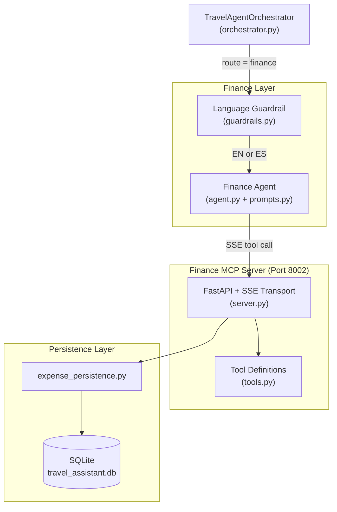

# Finance Service

## Overview

The Finance Service is the subsystem of the Travel Assistant responsible for managing all financial transactions during a trip. It is implemented as a decoupled, two-layer architecture:

1. **Finance Agent** (`app/agents/finance/`) — a LangChain sub-agent specialised exclusively in expense management, invoked by the orchestrator when the Supervisor routes a message to the `finance` domain.
2. **Finance MCP Server** (`app/mcp/finance/`) — an independent FastAPI process running on port `8002` that exposes CRUD expense tools over the Model Context Protocol (MCP) via Server-Sent Events (SSE).

---

## Architecture



---

## Finance Agent (`app/agents/finance/`)

### Files

| File | Purpose |
|------|---------|
| `agent.py` | Factory function `create_finance_agent(llm, tools)` that compiles the LangGraph agent |
| `prompts.py` | `get_finance_system_prompt()` — builds the finance-specific system prompt |
| `guardrails.py` | `check_finance_language(text)` — blocks non-EN/ES input before agent invocation |

### Agent behaviour

- Created via `create_agent(llm, tools, system_prompt=...)` from LangChain.
- Receives only the finance-specific tools discovered from the Finance MCP Server (port `8002`), preventing any cross-domain tool contamination.
- Stateless: no internal checkpointer. Memory and conversation history are injected as context by the orchestrator.

### System prompt directives (`prompts.py`)

1. **Tool selection**: maps user intent directly to the correct MCP tool (`budget`, `query_expenses`, `record_expense`, `modify_expense`, `delete_expense`).
2. **Structured Markdown output**: when tool data is available, the agent always renders a full breakdown — total, count, per-category summary, and dated item list.
3. **Multilingual**: always replies in the language the user wrote in (English or Spanish).
4. **Date resolution**: resolves relative date expressions (e.g. "yesterday", "last week") using the injected current date context and filters results client-side, since the tools do not accept date parameters.

### Language Guardrail

Before the Finance Agent is ever invoked, the orchestrator calls `check_finance_language(message)`. See [Finance Language Guardrail](Finance%20Language%20Guardrail.md) for full details.

---

## Finance MCP Server (`app/mcp/finance/`)

### Files

| File | Purpose |
|------|---------|
| `server.py` | FastAPI app, SSE transport setup, MCP tool handlers, and `run()` entrypoint |
| `tools.py` | `EXPENSE_TOOLS` — structured `mcp.types.Tool` definitions for all 5 tools |

### Endpoints

| Method | Route | Description |
|--------|-------|-------------|
| `GET` | `/sse` | SSE stream endpoint for MCP client connections |
| `POST` | `/messages` | Message posting endpoint for MCP protocol |
| `GET` | `/status` | Returns server health and full tool catalog |

### MCP Tools

| Tool | Required params | Optional params | Description |
|------|----------------|-----------------|-------------|
| `record_expense` | `amount` (float), `description` (str), `category` (str) | — | Records a new expense in the database |
| `query_expenses` | — | `category` (str) | Returns all expenses, optionally filtered by category |
| `budget` | — | — | Returns total budget summary with per-category breakdown |
| `modify_expense` | `id` (int) | `amount`, `description`, `category` | Updates one or more fields of an existing expense |
| `delete_expense` | `id` (int) | — | Permanently deletes an expense from the database |

### Transport

The server uses `mcp.server.sse.SseServerTransport` mounted on `/messages`. Two ASGI wrapper classes (`SSEASGIApp`, `MessageASGIApp`) are registered as Starlette `Route` objects to bypass FastAPI's default `request_response` wrapping, which is incompatible with the MCP SSE protocol.

---

## Persistence Layer (`app/services/persistence/expense_persistence.py`)

The MCP server delegates all database operations to `expense_persistence.py`, which wraps SQLAlchemy calls against the shared SQLite database (`travel_assistant.db`).

| Function | Operation |
|----------|-----------|
| `save_expense(description, amount, category)` | INSERT |
| `get_expense_summary()` | SELECT all + aggregate by category |
| `modify_expense(id, ...)` | UPDATE |
| `delete_expense(id)` | DELETE |

---

## Configuration

| Environment variable | Default | Description |
|----------------------|---------|-------------|
| `MCP_SERVERS` | `http://localhost:8002/sse/,...` | Comma-separated SSE URLs consumed by the orchestrator |
| `MCP_FINANCE_SERVER_STATUS_URL` | `http://localhost:8002/status` | URL polled by the main backend's `/status` endpoint |
| `UVICORN_RELOAD` | `false` | Set to `true` to enable hot-reload during development |

---

## Running the Finance MCP Server

### As part of the full system (recommended)

```bash
./start.sh
```

Logs are written to `logs/finance.log`.

### Standalone

```bash
python -m app.mcp.finance.server
```

The server starts on `http://0.0.0.0:8002`.

---

## E2E Test Examples

```bash
# Record an expense (routes to finance agent → record_expense tool)
curl -X POST http://localhost:8000/message \
  -H "Content-Type: application/json" \
  -d '{"text": "Add an expense of 35 euros for dinner", "session_id": "fin_test"}'

# Query all expenses
curl -X POST http://localhost:8000/message \
  -H "Content-Type: application/json" \
  -d '{"text": "Show me all my expenses", "session_id": "fin_test"}'

# Guardrail test — should be blocked
curl -X POST http://localhost:8000/message \
  -H "Content-Type: application/json" \
  -d '{"text": "Enregistre une dépense de 20 euros pour le taxi", "session_id": "fin_test"}'
```
