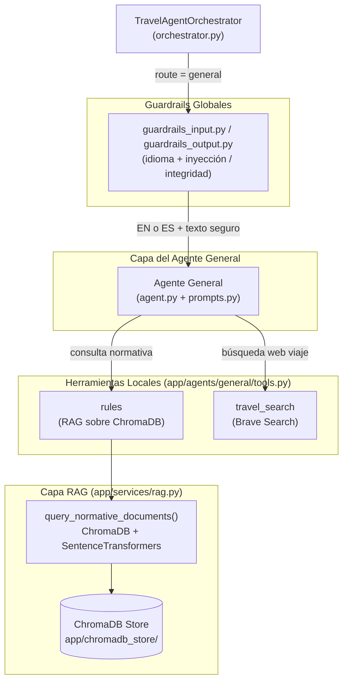

# Agente General de Normativas y Logística (General Agent)

## Descripción general

El Agente General es el sub-agente del Travel Assistant responsable de resolver consultas sobre **normativas de viaje** (visados, requisitos de entrada, pasaportes, vacunas, seguridad) y **logística** (vuelos, hoteles, rutas) mediante un sistema RAG (Retrieval-Augmented Generation) sobre documentos normativos europeos.

> **Alcance geográfico**: La base de datos RAG contiene exclusivamente documentación para destinos europeos. Consultas sobre países no europeos son rechazadas amigablemente.

---

## Arquitectura



---

## Agente General (`app/agents/general/`)

### Archivos

| Archivo | Propósito |
|---------|-----------|
| `agent.py` | Función fábrica `create_general_agent(llm)` que compila el agente LangGraph |
| `prompts.py` | `get_general_system_prompt()` — construye el prompt de sistema dinámico con restricción europea y contexto de fecha |
| `tools.py` | Definición de las 2 herramientas locales: `rules` y `travel_search` |
| `general_skill.md` | Especificación técnica interna del skill del agente general |

### Comportamiento del agente

- Creado mediante `create_agent(llm, tools, system_prompt=...)`.
- Recibe exclusivamente sus 2 herramientas locales (`rules` y `travel_search`), sin acceso a herramientas MCP.
- Sin estado (stateless): sin checkpointer interno. La memoria e historial conversacional son inyectados como contexto por el orquestador.

### Directrices del prompt de sistema (`prompts.py`)

El prompt se genera dinámicamente mediante `get_general_system_prompt()`, inyectando el contexto de fecha/hora actual desde `app/utils/date_resolution.py`.

1. **Herramienta `rules` obligatoria**: para cualquier consulta sobre visados, pasaportes, requisitos de entrada, documentación, vacunas, normativa COVID, seguridad o cualquier información normativa de viaje, se DEBE llamar a `rules`. La respuesta debe basarse exclusivamente en lo devuelto por la herramienta, sin añadir conocimiento externo.
2. **Herramienta `travel_search`**: para consultas sobre vuelos, hoteles, transporte, rutas o planificación de viaje. Usa Brave Search en tiempo real.
3. **Restricción europea estricta**: si el usuario consulta normativas de países no europeos y la consulta llega al agente, responde amablemente indicando que solo soporta regulaciones de destinos europeos.
4. **Respuesta fundamentada**: si la herramienta indica que la documentación es insuficiente, comunicarlo claramente. No inventar requisitos específicos de país.
5. **Multilingüe**: responder en el mismo idioma del usuario.
6. **Fuentes**: incluir las fuentes si son devueltas por la herramienta RAG.

---

## Herramientas Locales (`app/agents/general/tools.py`)

### 1. `rules`

| Campo | Detalle |
|-------|---------|
| **Tipo** | Herramienta local asíncrona |
| **Descripción** | MANDATORY para preguntas de normativa de viaje |
| **Parámetro** | `text` (str) — la consulta del usuario |
| **Backend** | `query_normative_documents(text)` en `app/services/rag.py` |
| **Retorna** | JSON con `{"query": "...", "answer": "...", "sources": [...]}` |
| **Fallback europeo** | Si no hay coincidencia semántica suficiente en ChromaDB (destino no europeo o sin documentación), retorna un mensaje de fallback localizado indicando la limitación |

### 2. `travel_search`

| Campo | Detalle |
|-------|---------|
| **Tipo** | Herramienta local asíncrona |
| **Backend** | Brave Search REST API (`api.search.brave.com`) |
| **Parámetro** | `text` (str) — la consulta de planificación de viaje del usuario |
| **Configuración** | Requiere `BRAVE_API_KEY` en `.env`. Opcionalmente `BRAVE_SEARCH_COUNT` (default: 5) |
| **Query** | Si la consulta tiene ≥ 4 palabras, se usa tal cual. Si es más corta, se añade el sufijo `travel` para contextualizar |
| **Retorna** | JSON con `{"query": "...", "results": [{title, url, description}, ...], "total": N}` |
| **Fallback** | Si `BRAVE_API_KEY` no está configurada, retorna un JSON con `warning` explicando la limitación (sin crash) |
| **Error handling** | Captura `TimeoutException`, `HTTPStatusError` y errores genéricos retornando `{"error": "..."}` |
| **Restricción** | Estrictamente de **solo lectura** para planificar y buscar información. No puede reservar, comprar ni registrar billetes o estadías |

---

## Capa RAG (`app/services/rag.py`)

El motor de recuperación semántica que da soporte al agente general:

| Componente | Detalle |
|------------|---------|
| **Base de datos vectorial** | ChromaDB con almacenamiento persistente en `app/chromadb_store/` |
| **Embeddings** | Sentence Transformers (`all-MiniLM-L6-v2`) |
| **Documentos** | Archivos normativos de viaje (`.txt` y `.pdf`) en `rag_docs/` |
| **Inicialización** | Lazy — se inicializa en el primer uso para no penalizar el arranque del servidor |
| **Restricción europea** | Si la similitud semántica es insuficiente o no hay resultados, devuelve un mensaje de fallback amigable localizado indicando que el soporte está limitado a Europa |

---

## Guardrail de seguridad

Los guardrails de idioma e inyección están centralizados en `app/agents/orchestrator/guardrails_input.py` (y los de salida en `guardrails_output.py`) y son ejecutados globalmente por el orquestador. Consulta [Guardrails.md](Guardrails.md) para los detalles completos.

---

## Configuración

No requiere variables de entorno adicionales específicas. El directorio de ChromaDB (`app/chromadb_store/`) y los documentos RAG (`rag_docs/`) deben estar presentes y populados.

---

## Ejemplos de prueba E2E

```bash
# Consulta de visado europeo (→ herramienta rules + RAG)
curl -s -X POST http://localhost:8000/message \
  -H "Content-Type: application/json" \
  -d '{"text": "Necesito visado para viajar a Francia desde España?", "session_id": "gen_test"}' | python3 -m json.tool

# Consulta en inglés
curl -s -X POST http://localhost:8000/message \
  -H "Content-Type: application/json" \
  -d '{"text": "What documents do I need to travel to Germany?", "session_id": "gen_test"}' | python3 -m json.tool

# Consulta fuera de Europa — debe retornar fallback amigable
curl -s -X POST http://localhost:8000/message \
  -H "Content-Type: application/json" \
  -d '{"text": "Necesito visado para Japón?", "session_id": "gen_test"}' | python3 -m json.tool

# Consulta de logística (placeholder)
curl -s -X POST http://localhost:8000/message \
  -H "Content-Type: application/json" \
  -d '{"text": "Busca vuelos a Roma para la próxima semana", "session_id": "gen_test"}' | python3 -m json.tool
```
