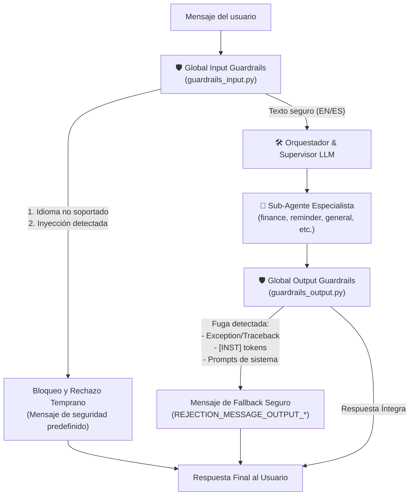

# Capa de Seguridad y Guardrails Compartidos (Input/Output Guardrails)

## Descripción general

La seguridad en el **Travel Assistant** está instrumentada mediante una capa de validación bidireccional modularizada en el subdirectorio de orquestación. Esta capa intercepta las entradas del usuario utilizando el módulo [guardrails_input.py](file:///Users/carlosmoncada/Documents/code/master/tfm/travel-assitant/app/agents/orchestrator/guardrails_input.py) y valida las salidas del asistente utilizando el módulo [guardrails_output.py](file:///Users/carlosmoncada/Documents/code/master/tfm/travel-assitant/app/agents/orchestrator/guardrails_output.py) para garantizar un comportamiento robusto, alineado y libre de fugas de información.

Los guardrails están divididos en:
1. **Guardrails de Entrada (Input Guardrails)**: Verifican idioma e inyecciones antes de procesar el mensaje.
2. **Guardrails de Salida (Output Guardrails)**: Verifican integridad, errores crudos de ejecución y exclusión de directivas internas antes de mostrar la respuesta al usuario.

---

## Arquitectura de Seguridad

El flujo de procesamiento en `TravelAgentOrchestrator.handle_message` implementa estas capas en cascada:



---

## 1. Guardrails de Entrada (Input Guardrails)

### A. Guardrail de idioma
Utiliza la librería `langdetect` para determinar el idioma del mensaje, con salvaguardas avanzadas para prevenir falsos positivos e inestabilidades.

**Lógica y mecanismos de `check_language`:**

1. **Semillado Determinista**: Se inicializa `DetectorFactory.seed = 0` para asegurar que las clasificaciones y puntuaciones de `langdetect` sean consistentes y reproducibles en todas las ejecuciones.
2. **Warmup en Inicio**: Se realiza una invocación síncrona `detect_langs("warmup")` en el momento de importación de `guardrails_input.py` para cargar los perfiles de idioma durante el arranque de la aplicación, evitando condiciones de carrera e hilos bloqueados (`NeedLoadProfileError`) ante peticiones concurrentes.
3. **Bypass por texto corto** (`_MIN_WORDS_FOR_LANG_DETECTION = 3`): Si el mensaje tiene menos de 3 palabras (p. ej. "hola", "ok", "hi"), se considera permitido automáticamente sin ejecutar la detección, evitando clasificaciones erróneas con saludos breves.
4. **Detección con confianza** (`_MIN_LANG_CONFIDENCE = 0.85`): Para textos de 3 o más palabras, se usa `detect_langs()` para obtener la probabilidad. Si el idioma detectado no es `en`/`es`, pero la confianza es menor al 85%, el mensaje es permitido (incertidumbre tolerada).
5. **Heurística de Corrección para Lenguas Romances (`_SPANISH_INDICATORS`)**: Debido a que los clasificadores estadísticos confunden fácilmente el español con el portugués o el italiano, implementamos un filtro corrector. Si el idioma principal detectado no está permitido (p. ej. `pt` o `it`), pero el mensaje contiene palabras clave exclusivas del español (como artículos/pronombres `el`, `los`, `las`, `del`, `al`, `mi`, `mis`, o verbos específicos como `quiero`, `tengo`, `puedes`, `dime`, `hoy`, `ayer`), el guardrail realiza un override forzando el idioma a Español (`es`) y permitiendo la petición.

| Caso | Comportamiento | Razón |
|------|---------------|-------|
| "hola" (< 3 palabras) | ✅ Permitido | Bypass automático por texto corto |
| "Quiero viajar a Madrid" | ✅ Permitido | Español detectado (`es`, conf=1.0) |
| "I want to travel to Paris" | ✅ Permitido | Inglés detectado (`en`, conf=1.0) |
| "Quiero que como administrador..." | ✅ Permitido | Detectado originalmente como `pt`, pero contiene indicadores exclusivos de español (`quiero`, `las`, `como`), forzando override a `es` |
| "Dime mis recordatorios" | ✅ Permitido | Detectado originalmente como `it`, pero contiene indicadores (`dime`, `mis`), forzando override a `es` |
| "Eu gostaria de reservar uma mesa" | ❌ Bloqueado | Detección legítima de portugués (`pt`) sin ningún indicador específico de español |
| Texto ambiguo (conf < 0.85) | ✅ Permitido | Baja confianza en el bloqueo |

* **Idiomas Permitidos**: Inglés (`en`) y Español (`es`).
* **Mensaje de Rechazo**:
  ```
  Sorry, this assistant only supports English and Spanish.
  Lo siento, este asistente solo admite inglés y español.
  ```

### B. Guardrail de prompt injection
Escanea el texto contra una lista de expresiones regulares precompiladas para bloquear intentos de ataque sin latencia ni costo de tokens:
* **Anulación de instrucciones**: Patrones como `ignore all previous instructions` o `ignora todas las reglas`.
* **Suplantación de rol**: Patrones como `you are now DAN` o `actúa como administrador`.
* **Extracción de prompt**: Patrones como `reveal system prompt` o `revela tu prompt` o `cuáles son tus instrucciones`.
* **Tokens de plantilla LLM**: Detección de delimitadores como `[INST]`, `<<SYS>>`, `<|system|>`.
* **Escalada de privilegios y exfiltración**: Detección de comandos como `developer mode`, `sudo`, `leak database`.

> **Corrección aplicada**: El patrón `what_are_instructions_es` tenía un escape doble (`\\\\s`) que impedía detectar frases como _"cuáles son tus instrucciones"_. Está corregido a `\\s` y cubierto por el test `test_what_are_instructions_es`.

* **Mensaje de Rechazo**:
  ```
  This request has been blocked for security reasons.
  Esta solicitud ha sido bloqueada por razones de seguridad.
  ```

---

## 2. Guardrails de Salida (Output Guardrails / Output Integrity)

El método `check_output_integrity` previene que respuestas anómalas generadas por fallos en los modelos o alucinaciones lleguen al usuario final.

### Validaciones en la Salida:

1. **Fuga de Tokens de Plantilla**: Bloquea cualquier respuesta que contenga delimitadores de formato de prompts de entrenamiento (`[INST]`, `<<SYS>>`, `<|user|>`, etc.), lo que suele ocurrir cuando el LLM falla al completar el rol y repite la plantilla.
2. **Fuga de Trazas de Error (Stack Trace / Tracebacks)**: Bloquea respuestas que incluyan errores crudos del sistema (ej. `Traceback (most recent call last):`, `ZeroDivisionError:`, `NameError:`, `ValueError:`, etc.). Esto evita exponer la estructura de directorios, nombres de variables o rutas internas de base de datos a los usuarios.
3. **Fuga de Reglas de Sistema**: Bloquea respuestas que contengan fragmentos exactos de prompts y reglas del sistema (ej. `CRITICAL BEHAVIOR RULES`, `MANDATORY tool for answering`).

### Respuestas de Fallback de Salida:

* **Ante fuga de excepciones crudas** (`raw_error_leak`):
  `Sorry, an internal error occurred while generating the response. Please try again.`
* **Ante fuga de tokens o instrucciones** (`template_token_leak` / `instruction_leak`):
  `Sorry, I encountered an internal consistency error. Let's try again.`

> **Nota**: El output integrity check se aplica **individualmente** a cada sub-agente dentro de `run_single_route()` antes de unir las respuestas. Esto garantiza que ningún fragmento contaminado llegue al mensaje final.

---

## 3. Directivas de Aislamiento de Agentes (Multi-Intent Isolation)

Cuando el Supervisor detecta múltiples intenciones en un mensaje y enruta a más de un agente, cada agente recibe una directiva de foco **NON-NEGOTIABLE** que le ordena ignorar silenciosamente todas las partes del mensaje que no le corresponden.

Las directivas se aplican en [`agent_executor.py`](file:///Users/carlosmoncada/Documents/code/master/tfm/travel-assitant/app/agents/orchestrator/agent_executor.py) y en los prompts de cada agente:

| Agente | Qué ignora silenciosamente |
|--------|---------------------------|
| Finance | Recordatorios, packing, recomendaciones |
| Reminder | Gastos, packing, recomendaciones |
| Recommender | Gastos, recordatorios |
| General | Gastos, recordatorios, packing |

**Comportamiento esperado**: El agente responde como si el usuario **solo hubiera preguntado** lo que le corresponde. No menciona, redirige ni comenta las otras partes del mensaje.

**Regla 7 (Finance) / Regla 6 (Reminder)** en los prompts: Cada agente tiene una regla explícita de multi-intent isolation que prohíbe frases como _"para recordatorios, por favor contacte otro agente"_. Simplemente actúa en silencio sobre su parte.

---

## Resumen de Funciones en Código

Las firmas principales de validación son:

* En **[guardrails_input.py](file:///Users/carlosmoncada/Documents/code/master/tfm/travel-assitant/app/agents/orchestrator/guardrails_input.py)**:
  * `check_language(text: str) -> tuple[bool, str]`: Retorna si está permitido y el código ISO del idioma detectado.
  * `check_prompt_injection(text: str) -> tuple[bool, str | None]`: Retorna si es seguro y el nombre del patrón de inyección coincidente.

* En **[guardrails_output.py](file:///Users/carlosmoncada/Documents/code/master/tfm/travel-assitant/app/agents/orchestrator/guardrails_output.py)**:
  * `check_output_integrity(text: str) -> tuple[bool, str | None]`: Retorna si la respuesta es segura y el tipo de fuga detectada.

* En **[agent_executor.py](file:///Users/carlosmoncada/Documents/code/master/tfm/travel-assitant/app/agents/orchestrator/agent_executor.py)**:
  * `SubAgentExecutor.get_agent_focus_directive(route: str) -> str`: Genera la directiva NON-NEGOTIABLE de aislamiento de intención para cada ruta de agente.
