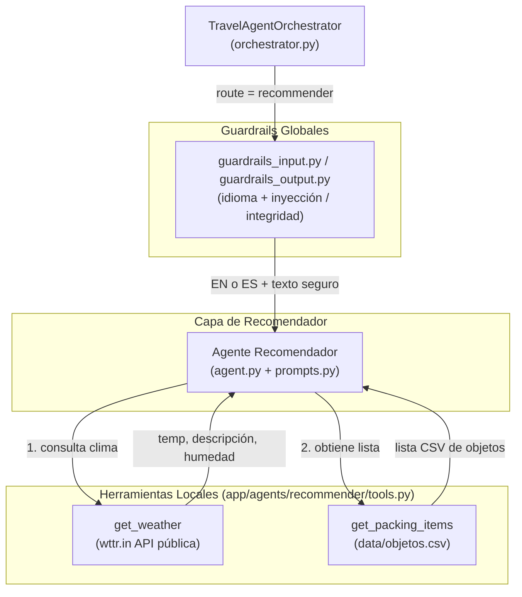

# Agente Recomendador de Equipaje (Recommender Agent)

## Descripción general

El Agente Recomendador es el sub-agente del Travel Assistant responsable de sugerir y clasificar el equipaje óptimo para un viaje en función del destino, el clima actual y la duración del viaje. A diferencia de los agentes de Finance y Reminder, opera **exclusivamente con herramientas locales** — sin servidor MCP ni base de datos propia.

---

## Arquitectura



---

## Agente Recomendador (`app/agents/recommender/`)

### Archivos

| Archivo | Propósito |
|---------|-----------|
| `agent.py` | Función fábrica `create_recommender_agent(llm)` que compila el agente LangGraph |
| `prompts.py` | `get_recommender_system_prompt()` — construye el prompt de sistema con contexto de fecha actual |
| `tools.py` | Definición de las 2 herramientas locales: `get_weather` y `get_packing_items` |
| `recommender_skill.md` | Especificación técnica interna del skill del agente recomendador |

### Comportamiento del agente

- Creado mediante `create_agent(llm, tools, system_prompt=...)`.
- Recibe exclusivamente sus 2 herramientas locales, sin acceso a herramientas MCP.
- Sin estado (stateless): sin checkpointer interno. La memoria e historial conversacional son inyectados como contexto por el orquestador.

### Directrices del prompt de sistema (`prompts.py`)

El prompt se genera dinámicamente mediante `get_recommender_system_prompt()`, que inyecta el contexto de fecha/hora actual desde `app/utils/date_resolution.py`.

**Flujo de ejecución obligatorio (en orden):**
1. Llamar a `get_weather` con la ciudad de destino.
2. Llamar a `get_packing_items` para obtener la lista completa de objetos del CSV.
3. Clasificar **cada** objeto en exactamente una de las tres categorías:
   - **OBLIGATORIOS / MUST BRING** — imprescindibles dado el clima.
   - **RECOMENDADOS / RECOMMENDED** — útiles pero no estrictamente necesarios.
   - **DESCARTADOS / SKIP** — inapropiados o innecesarios para esas condiciones.

**Reglas de clasificación:**
- Basarse en temperatura, lluvia/precipitación, duración del viaje y tipo de destino (urbano, playa, montaña).
- Si el clima no puede obtenerse, clasificar según el nombre del destino indicando la indisponibilidad.
- No inventar objetos que no estén en la lista CSV.
- Responder en el mismo idioma que usó el usuario (español o inglés).

---

## Herramientas Locales (`app/agents/recommender/tools.py`)

### 1. `get_weather`

| Campo | Detalle |
|-------|---------|
| **Tipo** | Herramienta local asíncrona |
| **Fuente de datos** | API pública `wttr.in` (sin autenticación) |
| **Parámetro** | `city` (str) — nombre de la ciudad |
| **URL** | `https://wttr.in/{city}?format=j1` con URL-encode vía `urllib.parse.quote` |
| **Timeout** | 10 segundos |
| **Retorna** | JSON con `city`, `temperature_c`, `feels_like_c`, `description`, `humidity_pct`, `precipitation_mm` |
| **Error handling** | Captura `httpx.HTTPError`, `KeyError`, `IndexError`, `ValueError` y retorna `{"error": "..."}` |

> **Nota**: Se utiliza `urllib.parse.quote(city)` (stdlib estándar de Python) para codificar nombres de ciudades con espacios o caracteres especiales. **No usar** `httpx.utils.quote` — esa API interna fue eliminada en versiones recientes de httpx.

### 2. `get_packing_items`

| Campo | Detalle |
|-------|---------|
| **Tipo** | Herramienta local asíncrona |
| **Fuente de datos** | CSV local en `app/data/objetos.csv` |
| **Parámetros** | Ninguno |
| **Retorna** | JSON con `{"items": [...], "total": N}` |
| **Error handling** | Captura `OSError`, `csv.Error` y retorna `{"error": "..."}` |

---

## Guardrail de seguridad

Los guardrails de idioma e inyección están centralizados en `app/agents/orchestrator/guardrails_input.py` (y los de salida en `guardrails_output.py`) y son ejecutados globalmente por el orquestador. Consulta [Guardrails.md](Guardrails.md) para los detalles completos.

---

## Configuración

No requiere variables de entorno adicionales. El servidor `wttr.in` es público y no necesita autenticación. El archivo CSV de objetos se localiza en `app/data/objetos.csv` relativo a la raíz del proyecto.

---

## Ejemplos de prueba E2E

```bash
# Recomendación de equipaje para un destino
curl -s -X POST http://localhost:8000/message \
  -H "Content-Type: application/json" \
  -d '{"text": "Voy a Barcelona la próxima semana, qué ropa me llevo?", "session_id": "rec_test"}' | python3 -m json.tool

# En inglés
curl -s -X POST http://localhost:8000/message \
  -H "Content-Type: application/json" \
  -d '{"text": "I am travelling to London for 5 days, what should I pack?", "session_id": "rec_test"}' | python3 -m json.tool

# Destino de montaña
curl -s -X POST http://localhost:8000/message \
  -H "Content-Type: application/json" \
  -d '{"text": "Viajo a los Alpes suizos, recomiéndame equipaje", "session_id": "rec_test"}' | python3 -m json.tool
```
